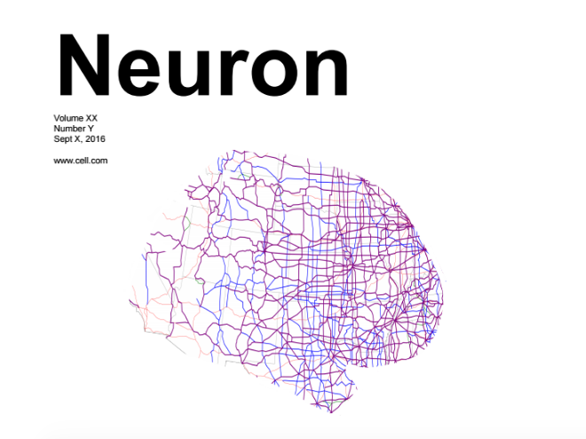
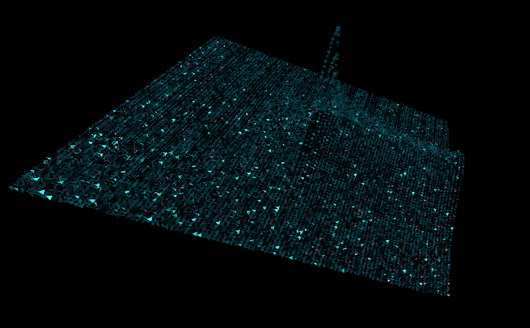
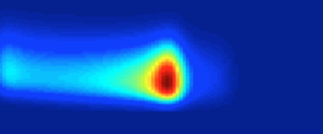
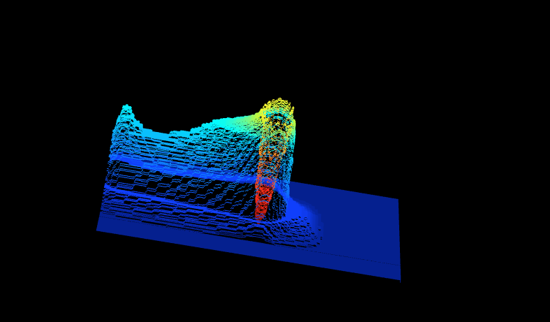
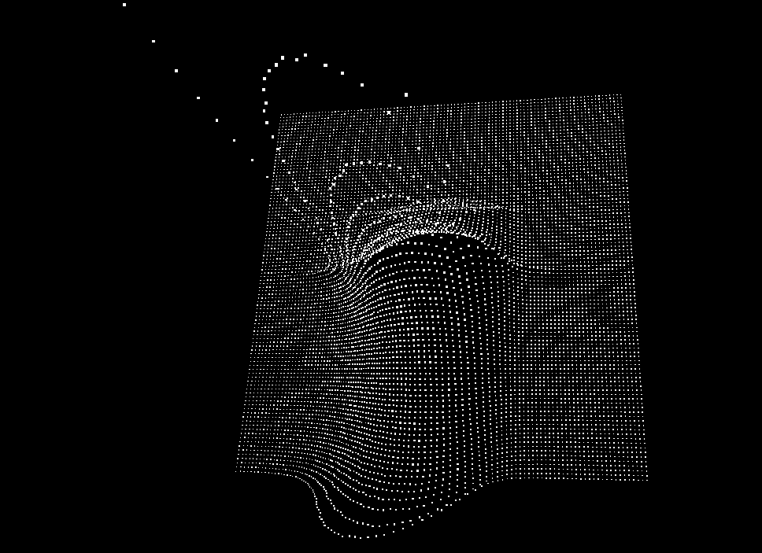
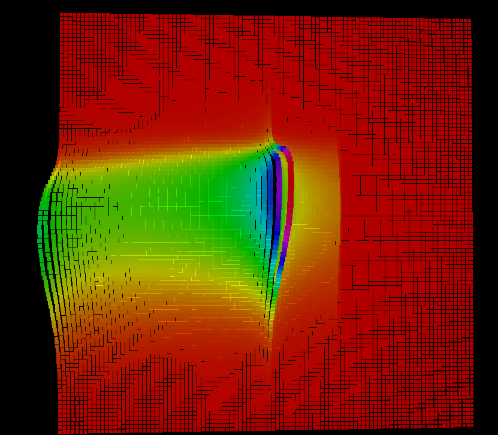
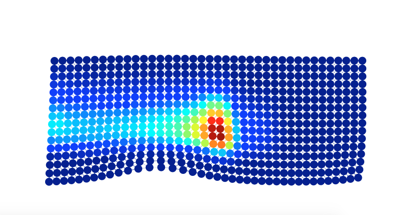
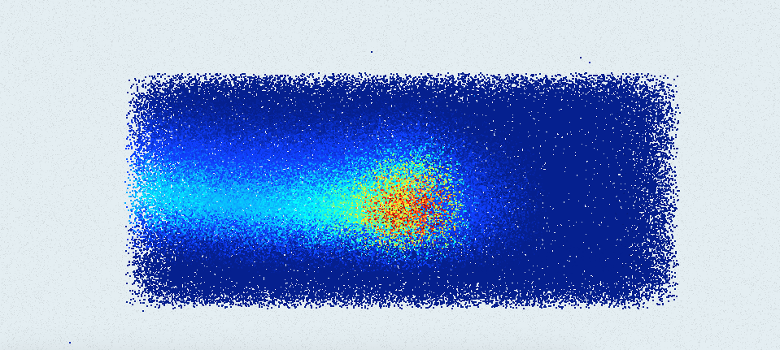
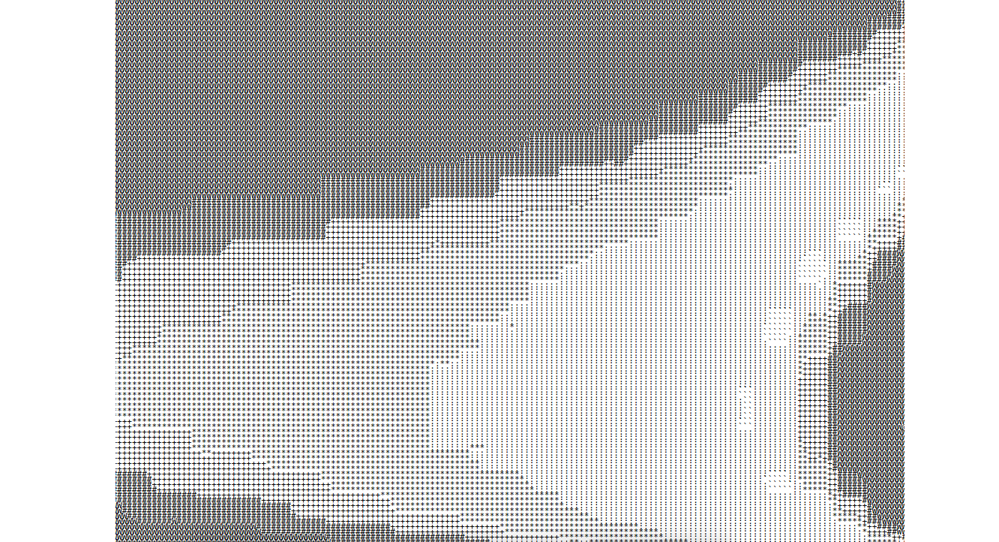

# Network Integration Vis

Here are a few examples of plotting a network integration matrix using three.js, with the goal to have fun a learn a bit about three.js (a JavaScript library for WebGL). I will play around with different visualizations and think about the data. Mac's initial goal:

>> I really want to incorporate something to do with networks and integration along with an image of the brain. The best idea I’ve come up thus far is attached. I’d love to hear everyone’s opinion and of course, any alternative suggestions that come to mind!

The original image I like a lot, it's a map that has been cropped into the shape of a brain. This would work for any sort of visualization, given that the background is white:

Russ liked the idea as well, he suggested:

>> Those are super cool- maybe a projection of the cartographic profile into 3D?

However I decided to start with a visualization of the "funny cloud-looking thing that maps the integration signature of a network) per Mac's request:

>> — it should be a 101 x 101 matrix in which the intensity in each cell reflects the likelihood that a particular combination of network characteristics were present in the data. I’ve attached a screen capture of the 2d representation of the figure, in case you want a quick look at the basic outline that we might want to recapitulate/make look way cooler

This is where we will start! 

## Data Preparation
Is done with [prep/format_data.py](prep/format_data.py). We read in our data with `pandas` and prepare two versions of it, one that includes nonzero values, and one that does not. Each is parsed into a JSON data structure that captures the x and y coordinate, along with the likelihood value (z). A single data point might look like this:

      {
          "x": 1,
          "y": 2,
          "value": 0.052 
      }

Additionally, I prepared a normalized verison of each of the above, meaning that the x, y, and value are all transformed between -1 and 1. The reason for this is because many visualizations seem to have preference to splot the origin in the center, and go in positive and negative x,y, and z directions.

## Particles
The most (obvious) idea is to try something that is particle based. The x and y coordinates are easy - we plot them as vertical and horizontal axis. However, the likelihood value isn't as clear. Should we plot it as a color, as Mac does with the 2D image? Should we try for an actual z (depth) value? I decided to try a combination of these things in the following test / demo visualizations.

### Visualization #1:

[https://vsoch.github.io/network-integration-vis/vis1.html](https://vsoch.github.io/network-integration-vis/vis1.html)

I first decided to render the likelihood as a height, and so the more likely areas would form elevated curves. My first effort was overkill - the points themselves have an additional animation, a [Buffer Animation System](https://github.com/zadvorsky/three.bas) that is a custom prototype to add what the author calls "shader chunks." Since I am relatively new to three.js, I decided that learning about this customization wouldn't be the best use of energy. It also had absolutely no vibe of "network" or "integration" or even "cloud". However, this was the first glimpse at the shape of the data, and I immediately noticed a truncation at the highest value that doesn't seem to appear in the 2D image.

Either reading the data from Matlab --> Python resulting in some kind of artifact, or perhaps the default Matlab plotting function scale --> color function smooshes all the highest values into the upper range, and misses the detail. I'll leave this one for @macshine to check out.

### Visualization #2:

[https://vsoch.github.io/network-integration-vis/vis2.html](https://vsoch.github.io/network-integration-vis/vis2.html)

I next decided to use the image that Mac liked a lot, and I found a trick to use the pixels from the png image to render an animation.

This one I call "the slinky." This method could be nice because it would allow @macshine (or any researcher) to input some static png, and turn it into a 3D object that renders an animation based on the color value.

### Visualization #3:

[https://vsoch.github.io/network-integration-vis/vis3.html](https://vsoch.github.io/network-integration-vis/vis3.html)

This is a simplified version of the first visualization - the particle points cloud minus the custom stuff. I used it for the basis of the next visualization, where I decided to try coloring the points based on the likelihood.

### Visualization #4:

[https://vsoch.github.io/network-integration-vis/vis4.html](https://vsoch.github.io/network-integration-vis/vis4.html)

This view, and with both color and depth, gives more information than the previous, but it's still not that great.

### Visualization #5:

[https://vsoch.github.io/network-integration-vis/vis5.html](https://vsoch.github.io/network-integration-vis/vis5.html)

Time to just forget about the templates above, and go nuts :)

### Visualization #6:

[https://vsoch.github.io/network-integration-vis/vis6.html](https://vsoch.github.io/network-integration-vis/vis6.html)

Now I'm just being irresponsible...

### Visualization #7:

[https://vsoch.github.io/network-integration-vis/vis7.html](https://vsoch.github.io/network-integration-vis/vis7.html)

Should probably stop this...

# Comments
@macshine - I think if we want to make an optimal visualization to match the idea of the paper, taking this approach we probably need to have something that is more akin to a network, and then make something with a graph. These particle systems are much more fit for that kind of display. We can integrate this likelihood space somewhere as well, but as a standalone it doesn't do the idea justice. I'd also suggest taking advantage of the browser and using some kind of temporal data, eg, showing the change of this plot over time. That would make these (sort of) boring visualizations much more useful, and you could send a link to Neuron that would let them render an svg for a particular view of the visualization that they like. For example, a simple network with changing strengths [could be animated](http://codepen.io/JulianLaval/pen/KpLXOO), and put against a background (that maybe also changes) to show the integration plot above.
